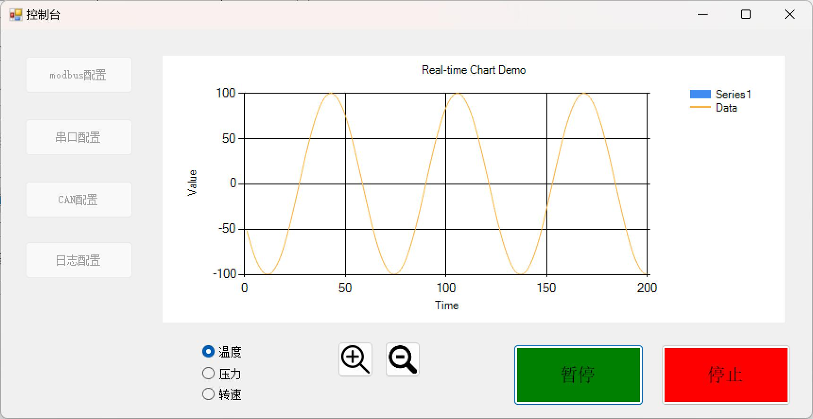
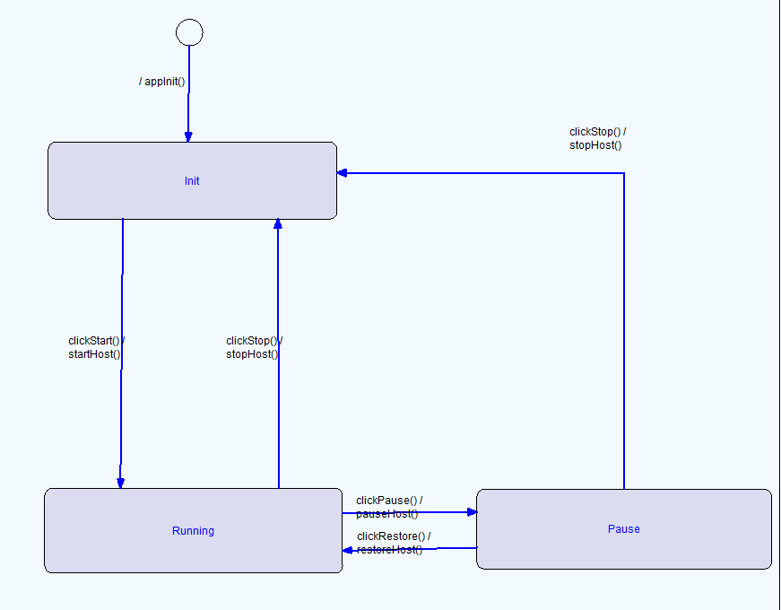

# 上位机状态机示例

欢迎使用[hoststate]，本文档将指导您如何使用本应用、了解代码目录结构以及如何使用Visual State生成状态机。

## 如何使用这个app

### 安装
1. 从[github releases]下载应用。
2. 也可以自己使用visual studio 2022以上版本编译生成

### 启动
- 双击图标启动应用应用。
- 仅在windows 10环境中测试通过

### 状态机截图

### 基本操作
- 点击开始模拟读取数据到时间轴
- 点击停止，停止更新时间轴
- 点击暂停，图标停止更新，数据后台更新
- 通过左边一栏修改模拟外设的配置
- 点击左下角单选框切换温度，压力和转速显示

### 功能特点
- 这个示例程序是一个C#的winform应用，使用IAR visual state生成状态机。界面的操作根据系统状态不同而表现不同。

## 代码目录结构
├── coder/ &nbsp;&nbsp;&nbsp;&nbsp;&nbsp;&nbsp;&nbsp;&nbsp;&nbsp;&nbsp;&nbsp;&nbsp;&nbsp;&nbsp;&nbsp;&nbsp;&nbsp;# 存放Visual State生成的C#代码  
├── hoststateform/&nbsp;&nbsp;&nbsp;&nbsp;&nbsp;# UI组件和Main函数  
├── vsp,vnw, etc...&nbsp;&nbsp;&nbsp;&nbsp;&nbsp;&nbsp;&nbsp;# 主目录保存的是visual state项目配置文件以及图片

